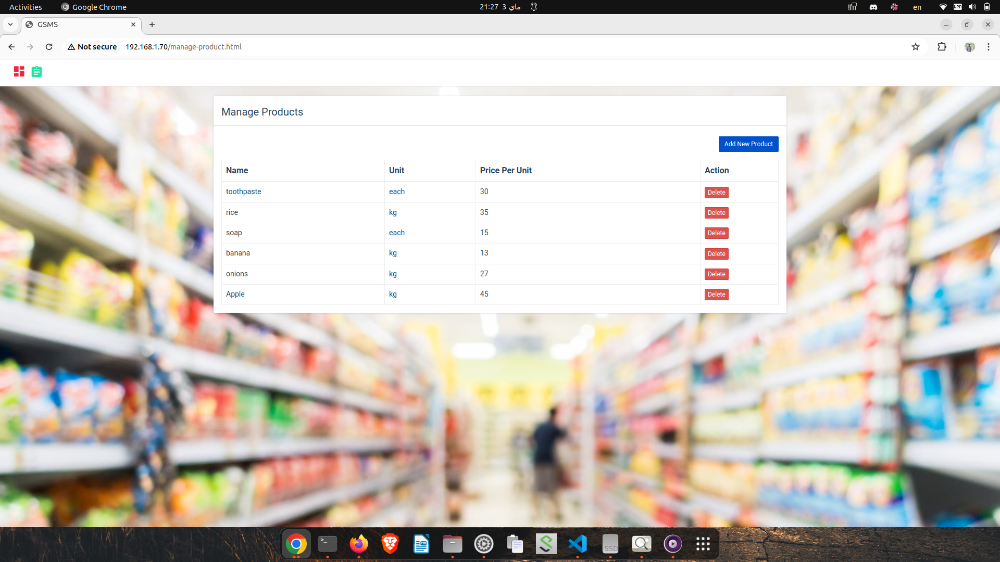
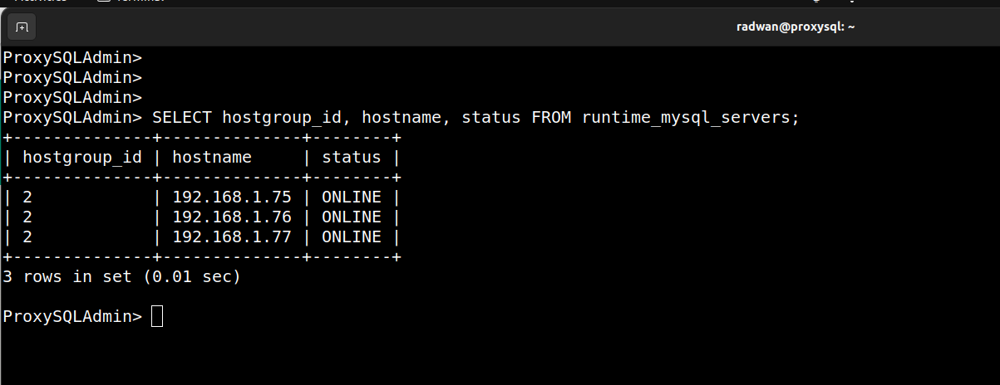
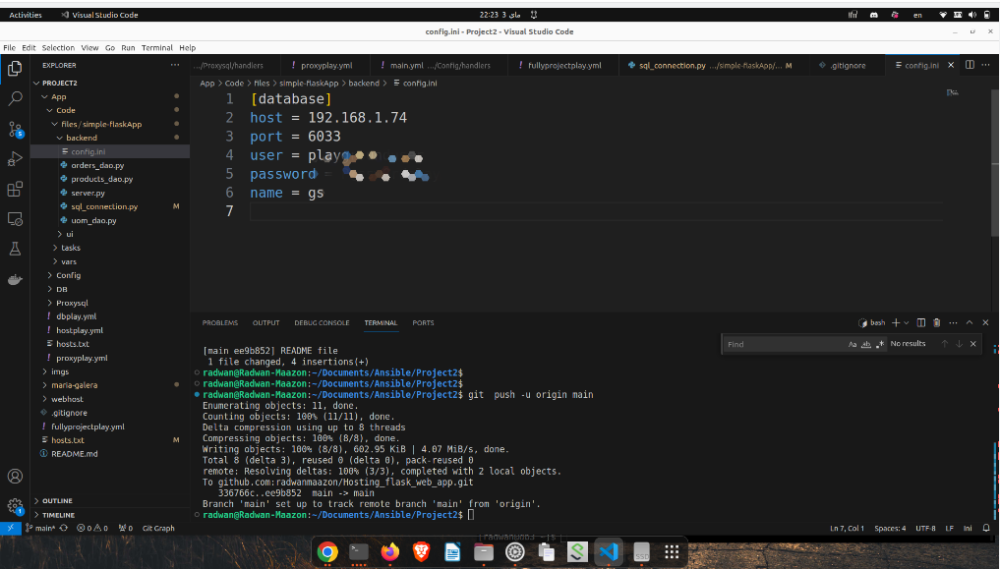
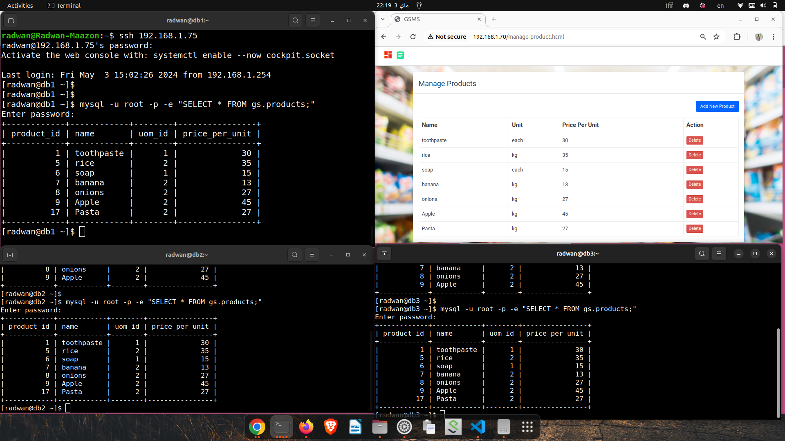
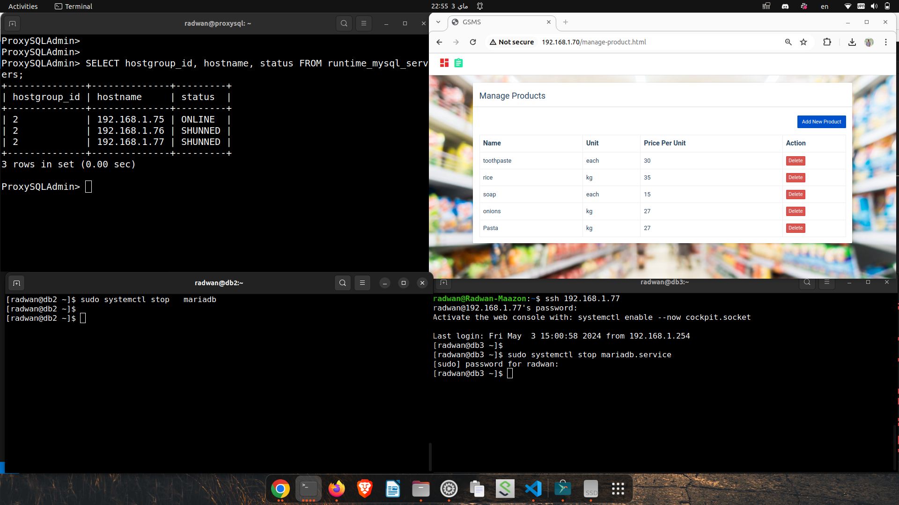
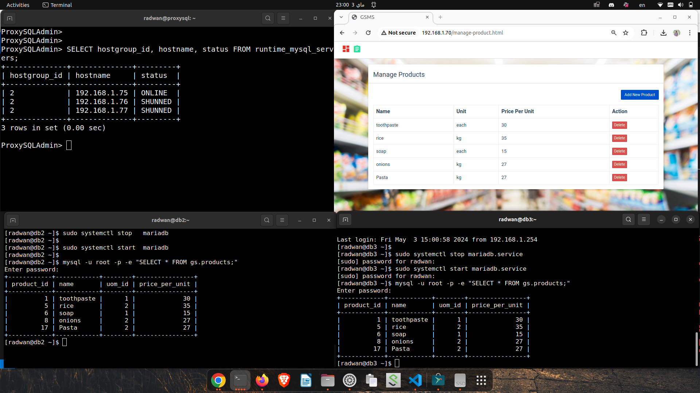

# Deploy full stack flask application by Ansible 
In this project I used flask application with mariaDB database and Nginx webserver.
I used galera cluster for Databases to let the application can use three nodes of mariaDB
I used proxysql as a loadbalancer to achieve high availability to accessing databases nodes.

## To run my Ansible project
``` sh 
    $ ansible-playbook -i hosts.txt fullyprojectplay.yml --vault-password-file ~/.passwords/vault-pass 
```
## Accessing flask application with browser


## DataBase on three db servers 


## Load Balancer 


## Connection to data base by load balancer (proxysql)


## New item has been added from browser 


## Two database servers down and 2 items have been removed from database 


## Restart the db servers to be online and check if it read the change in the items


## Ownership
|
|:-----------------:|
|[Radwan Maazon](https://github.com/redwan2050)|
